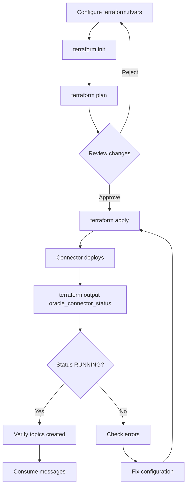

# Oracle JDBC Connector - Terraform Files Summary

## Files Created

### 1. `oracle-connector.tf`
**Purpose:** Main Terraform resource for Oracle JDBC Source Connector  
**Contains:**
- `confluent` provider configuration
- `confluent_connector` resource for Oracle RAC
- Connector configuration (sensitive and non-sensitive)
- Dependency on AppGW deployment

**Usage:** Automatically included when running `terraform apply`

---

### 2. `oracle-connector-variables.tf`
**Purpose:** All variable definitions for Oracle connector  
**Contains:**
- 25+ configurable variables
- Validation rules for inputs
- Sensible defaults
- Sensitive variable marking

**Categories:**
- Connector control (enable/disable)
- Confluent Cloud credentials
- Oracle connection settings
- Table selection and CDC mode
- Polling configuration
- Output format options

---

### 3. `oracle-connector-outputs.tf`
**Purpose:** Terraform outputs for connector status and verification  
**Provides:**
- Connector ID
- Connector status (RUNNING/FAILED/etc.)
- Expected Kafka topics
- Connection details
- Verification commands

**Usage:**
```bash
terraform output oracle_connector_status
terraform output oracle_connector_verification_commands
```

---

### 4. `terraform.tfvars.oracle-connector.example`
**Purpose:** Example configuration with documentation  
**Contains:**
- Complete working examples
- Multiple configuration scenarios
- Inline documentation
- Deployment instructions

**Usage:** Copy variables to your `terraform.tfvars`

---

### 5. `ORACLE-CONNECTOR-TERRAFORM.md`
**Purpose:** Complete deployment guide  
**Sections:**
- Quick start (4 steps)
- Configuration examples
- Variable reference
- Troubleshooting
- Best practices
- Terraform vs manual comparison

---

## Deployment Workflow



---

## Quick Reference

### Enable Connector

```hcl
# terraform.tfvars
create_oracle_connector = true
```

### Required Variables

```hcl
confluent_cloud_api_key    = "CLOUD_API_KEY"
confluent_cloud_api_secret = "CLOUD_API_SECRET"
confluent_environment_id   = "env-xxxxx"
kafka_cluster_id           = "lkc-xxxxx"
kafka_api_key              = "KAFKA_API_KEY"
kafka_api_secret           = "KAFKA_API_SECRET"

oracle_connection_host      = "racnode-scan.domain.com"
oracle_username             = "jdbc_connector"
oracle_password             = "Password123#"
oracle_db_name              = "pdb.domain.com"
oracle_table_include_list   = "SCHEMA.TABLE"
```

### Deploy

```bash
terraform init
terraform apply
```

### Verify

```bash
terraform output oracle_connector_status
terraform output -raw oracle_connector_verification_commands | bash
```

---

## File Relationships

```
terraform.tfvars
    ↓
oracle-connector-variables.tf (reads variables)
    ↓
oracle-connector.tf (creates connector)
    ↓
oracle-connector-outputs.tf (exports status)
```

---

## Documentation Hierarchy

1. **README.md** - Overview and deployment options
2. **ORACLE-CONNECTOR-TERRAFORM.md** - Complete Terraform guide
3. **terraform.tfvars.oracle-connector.example** - Configuration examples
4. **ORACLE-RAC-QUICKSTART.md** - Manual deployment alternative
5. **ORACLE-RAC-APPGW-SETUP.md** - Detailed architecture and troubleshooting

---

## Benefits of Terraform Deployment

✅ **Infrastructure as Code** - Version control connector configuration  
✅ **Automated Deployment** - Deploy AppGW and connector together  
✅ **Consistent Environments** - Same config across dev/staging/prod  
✅ **Drift Detection** - `terraform plan` shows config differences  
✅ **Easy Updates** - Change tfvars and apply  
✅ **Secrets Management** - Integration with remote state encryption  

---

## Next Steps

1. Review [ORACLE-CONNECTOR-TERRAFORM.md](ORACLE-CONNECTOR-TERRAFORM.md)
2. Copy variables from `terraform.tfvars.oracle-connector.example`
3. Configure your Oracle connection details
4. Run `terraform apply`
5. Verify with outputs

For manual deployment, see [ORACLE-RAC-QUICKSTART.md](ORACLE-RAC-QUICKSTART.md).
